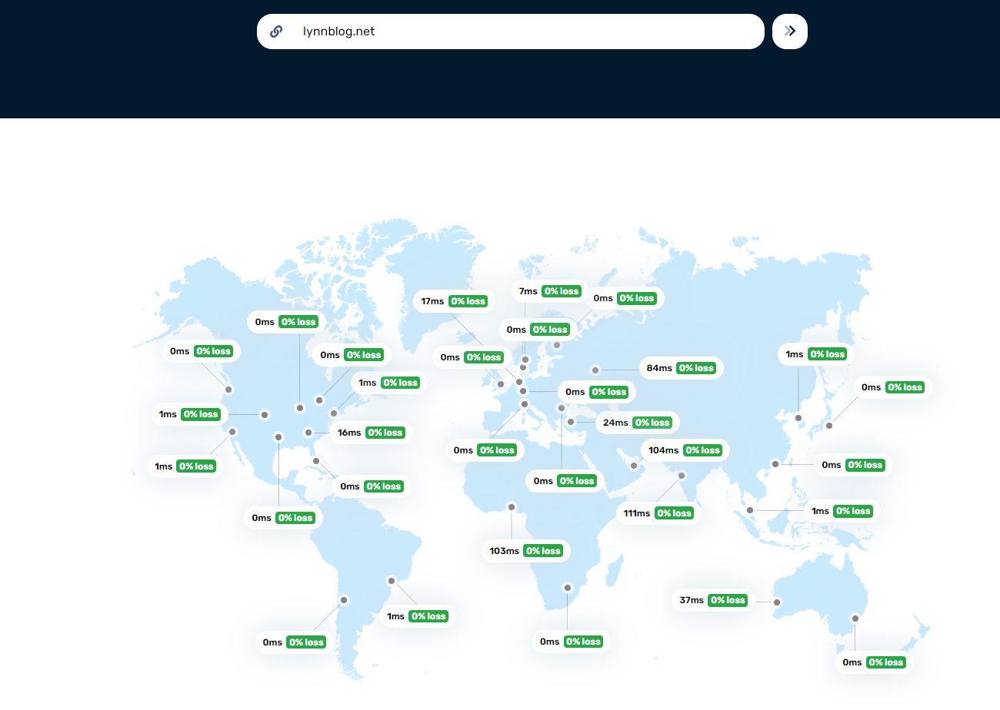

會選擇CloudFlare有幾個原因
1. 免費額度對Blog來說非常夠用
2. 順便摸一下CDN的設定
3. 我對Github的靜態網頁有其他規劃


cloudflare的 Pages 可以直很快的直接部屬網站，他支援上傳檔案或是直接跟GitHub、Gitlab進行整合，手動上這麼麻煩，當然是選擇跟Github自動整合


<!--more-->

Github一樣需要install Cloudflare的application
* https://github.com/settings/installations/34498409
 
建議只允許他訪問你設定的Repo就好

接下來選擇要部屬的Branch，還有是使用什麼指令部屬


也很貼心的讓你可以選擇Hugo，這邊要注意的是CloudFlare每次部屬都會有一組URL，假如沒有特別設定domain的話請在Build command 輸入hugo -b $CF_PAGES_URL，這樣你的網站才可以正常訪問
```
hugo -b $CF_PAGES_URL
```

**重要**
設定環境變數，可以在local使用 hugo version 查看版本號
```
HUGO_VERSION = 0.113.0
```
都結束後Cloudflare就會自己抓git repo的內容並部屬啦，如果有買domain也可以順便設定


使用 https://tools.bunny.net/latency-test 來測試CDN有沒有正常運行，可以看到大部分都是0 ms，有一個區域Fail了想必不是我的問題XD



接著只要把Repo裡面指定Branch有被更動，cloudflare就會自動去抓並部屬囉！


