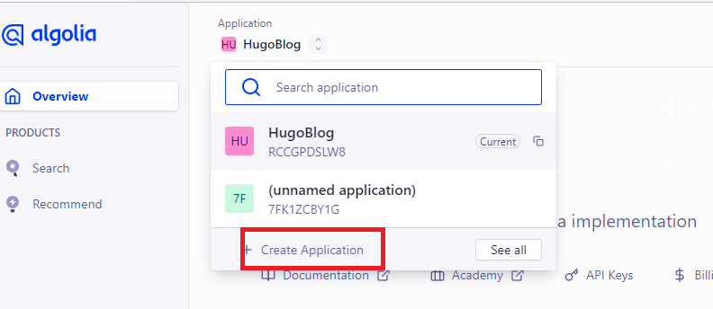
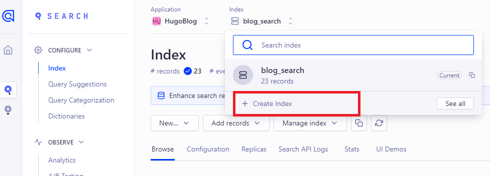
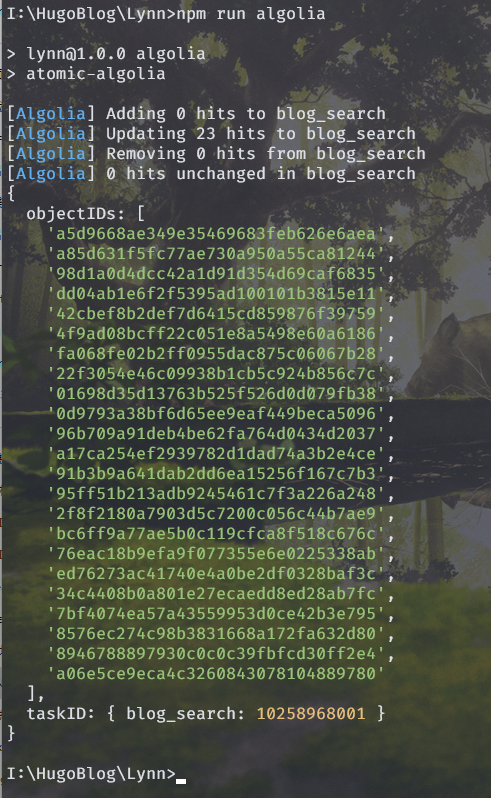
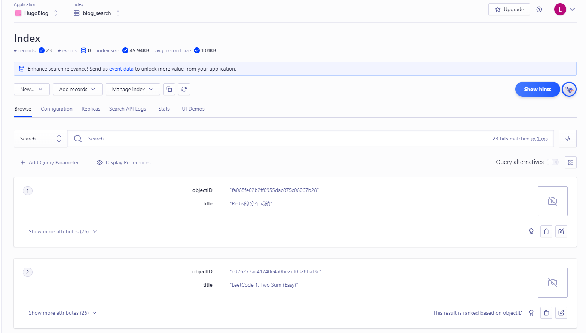
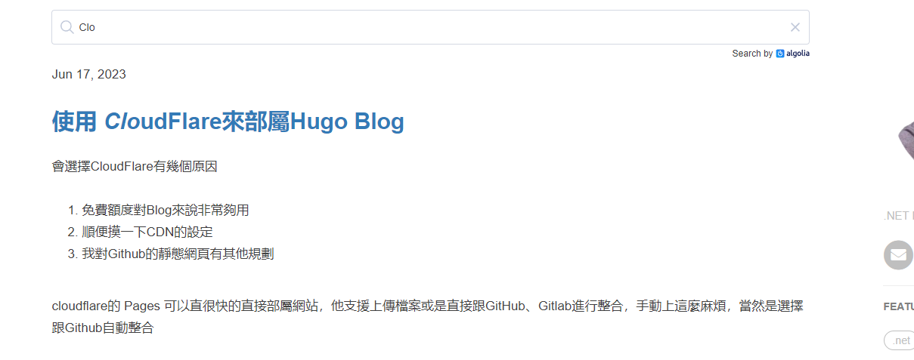

接下來就來新增搜尋功能吧！
不然有時候想找個文章也很麻煩。

稍微suvery一下後有幾種在Blog內全文搜尋的方式
    * [Google Custom Search](https://programmablesearchengine.google.com/about/)
    * [fusejs.io](https://fusejs.io/)
    * [Algolia](https://www.algolia.com/)

因為Clean White Theme這主題已經有支援Algolia，所以就直接來用用看吧！
假設主題沒有支援也沒關係，只需要在layout/default資料夾裡面寫一段json script就好了，網路上蠻多資源的。

有些人會覺得fusejs比較單純，因為他不需要依賴npm去build，造成部屬的麻煩，這等等會講到

<!--more-->

## 註冊Algolia的會員

註冊完後會看到預設是沒有Application的，直接先Create一個，方案選免費的就夠了


接著建立Index


接著到Application有個API Key的畫面，裡面有著我們需要的資訊。

## 設定相關Config

前面有說到因為Algolia相依nodejs，所以需要用npm來安裝
回到Blog的Folder底下輸入以下指令
```
npm init
npm install atomic-algolia --save
```
接著會看到package.json檔案，在這腳本裡面新增
```
"algolia": "atomic-algolia"
```
接著創建一個 .env 的檔案，裡面放相關的變數
```
ALGOLIA_APP_ID={{ YOUR_APP_ID }}
ALGOLIA_ADMIN_KEY={{ YOUR_ADMIN_KEY }}
ALGOLIA_INDEX_NAME={{ YOUR_INDEX_NAME }}
ALGOLIA_INDEX_FILE={{ PATH/TO/algolia.json }}
```
同時在hugo.toml的config檔也需要在params裡新增
```
  algolia_search = true
  algolia_appId = {{YOUR_APP_ID}}"
  algolia_indexName = {{ YOUR_INDEX_NAME }}
  algolia_apiKey = {{ YOUR_API_KEY }}
```
這樣就大功告成！ 首先執行hugo，會產生一個public的folder，裡面會有所有build起來的資料，會看到裡面有一個 algolia.json，裡面就是相關的索引資料，接著只要輸入 npm run algolia，就可以把資料推到algolia上了。
```
hugo
npm run algolia
```
看到以下結果就成功囉


去Algolia網站上也可以看到這些資訊


實際在網站上測試結果也OK


## 結合 Github Action 自動部屬

可以發現Algolia要執行npm run algolia才能把index推上去，這樣不是很麻煩嗎？
而且都使用Git去做管控了，就是不希望這些部屬的繁瑣流程還停留在環境上，

我不想要為了這個額外架Jenkins之類的，這時候Github Action就登場啦！
Github Action有機會在寫文章介紹，這邊直接講步驟

因為Key之類的敏感資料留在Git給人看也不好，所以要在Github Repo的Settings裡面，設定相關變數(記得也不要把.env檔上傳上去，除非你設定讀環境變數)


接著在Folder底下新建一個 .github/workflows/main.yml 的檔案
```
name: Build and Deploy

on:
  push:
    branches:
      - main

jobs:
  build:
    runs-on: ubuntu-latest

    steps:
      - name: Checkout
        uses: actions/checkout@v3
        with:
          submodules: true

      - name: Setup Node.js
        uses: actions/setup-node@v2
        with:
          node-version: '14'

      - name: Install Dependencies
        run: |
          npm ci
          npm install atomic-algolia --save

      - name: Setup Hugo
        uses: peaceiris/actions-hugo@v2
        with:
          hugo-version: '0.113.0'
          extended: true
          
      - name: Build
        run: hugo
        
      - name: Run Algolia
        run: |
          ALGOLIA_APP_ID=${{ secrets.ALGOLIA_APP_ID }} \
          ALGOLIA_ADMIN_KEY=${{ secrets.ALGOLIA_ADMIN_KEY }} \
          ALGOLIA_INDEX_NAME=${{ secrets.ALGOLIA_INDEX_NAME }} \
          ALGOLIA_INDEX_FILE=${{ secrets.ALGOLIA_INDEX_FILE }} \
          npm run algolia
```
接著只要branch回main之後，就可以看到觸發這job，並成功執行囉


到這邊會發現CloudFlare的部分也可以直接寫在裡面，這就留著以後整合的時候更新了，畢竟他現在也Run的好好的XD