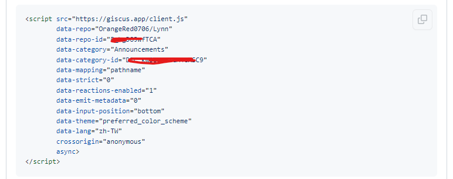

一般的Blog Engine多少都會有支援留言評論的擴充套件，不然也太無聊了吧XD

之前Hexo用的是 [Gitalk](ttps://github.com/gitalk/gitalk) ，而Hugo我觀察發現除了Gitalk以外，蠻多主題都有支援 [giscus](https://github.com/giscus/giscus) ，當作學習就來用用看giscus吧

<!--more-->

## 新增Gitcus

新增擴充功能也很簡單，直接在hugo.toml這config檔案加上這段就好了
```
[params.giscus]
data_repo="repo name"
data_repo_id="repo id"
data_category="announcements"
data_category_id="category id"
data_mapping="pathname"
data_reactions_enabled="1"
data_emit_metadata="0"
data_theme="light"
data_lang="en"
crossorigin="anonymous"
```

裡面的ID那些要從哪裡取得？

https://giscus.app/zh-CN

上面有說明首先
* git repo是要公開的，因為要讓大家都能看到 comment
* Github 上安裝 https://github.com/apps/giscus
    * 建議只允許他訪問你設定的Repo就好
     
* 在Repo裡面打開Discussions的功能 
    * Setting => Features => Discussions打勾，按下Set up discussions
    

接著可以在網站上輸入你的Repo名稱，往下選擇一些自訂的設定，最後取得Repo-id、category-id並更新在config檔就完成了


測試成功


