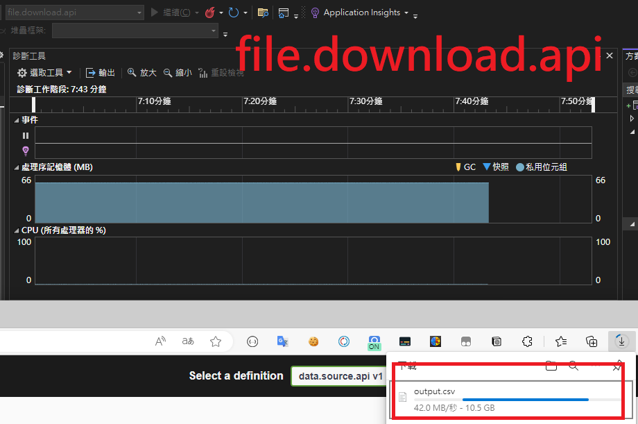

來還技術債啦！！！

剛入職時接到的第一份工作是要匯出一個API回傳的資料，並處理成CSV的格式匯出讓使用者下載，因為格式單純所以那時也沒有使用任何CSV的套件，就單純回傳一個組好的物件。

那時資料量不多，所以也安安穩穩的度過了一年的時間，直到最近資料量暴增，於是發生了OOM 😆

但目前很可惜要處理這問題的人並不是我，所以想說直接來練練手好了
<!--more-->

目前想到要處理大量資料的方式是這兩種
1. 批次取回資料
2. 使用Stream的方式

接著就做幾個API來模擬吧，我打算做兩個API，一個負責資料產生回傳，另外一隻則是提供下載，分別在兩個專案以方便觀察memory的成長量。

## 模擬API

### 前置作業: 

因為偷懶所以用command，可以忽略
```
dotnet new sln -n All
dotnet new webapi -n data.source.api
dotnet new webapi -n file.download.api
dotnet sln All.sln add ./data.source.api/
dotnet sln All.sln add ./file.download.api
```
### Example Code 

#### Datasource.api
產出五千萬筆的資料，使用AsyncEnumerable
```
    [HttpGet]
    [Route("get/big-data")]
    public async Task DownloadFile()
    {
        var numberOfLines = 50000000;

        Response.ContentType = "text/csv";
        Response.Headers["Content-Disposition"] = "attachment; filename=output.csv";

        await foreach (var line in GenerateCsvLines(numberOfLines))
        {
            var buffer = Encoding.UTF8.GetBytes(line);
            await Response.Body.WriteAsync(buffer, 0, buffer.Length);
            await Response.Body.FlushAsync();
        }

    }

    private async IAsyncEnumerable<string> GenerateCsvLines(int numberOfLines)
    {
        // Add column headers
        var header = new StringBuilder();
        for (int i = 1; i <= 10; i++)
        {
            if (i > 1)
            {
                header.Append(',');
            }

            header.Append("column" + i);
        }
        yield return header.ToString() + Environment.NewLine;

        for (var i = 0; i < numberOfLines; i++)
        {
            var sb = new StringBuilder();
            for (var j = 0; j < 10; j++)
            {
                if (j > 0)
                {
                    sb.Append(',');
                }

                sb.Append(Guid.NewGuid());
            }

            yield return sb.ToString() + Environment.NewLine;
        }
    }
```
#### Filedownload.api
使用FileStreamResult將API回傳的內容寫入Stream
```
   [HttpGet]
    [Route("api/download")]
    public async Task<IActionResult> DownloadFile()
    {
        var httpClient = new HttpClient();

        var url = "https://localhost:7124/DataSource/get-big-data/";

        var response = await httpClient.GetAsync(url, HttpCompletionOption.ResponseHeadersRead);

        if (!response.IsSuccessStatusCode)
        {
            return StatusCode((int)response.StatusCode);
        }

        var stream = await response.Content.ReadAsStreamAsync();

        var fileStreamResult = new FileStreamResult(stream, "text/csv")
        {
            FileDownloadName = "output.csv"
        };

        return fileStreamResult;
    }
```
## 測試結果: 
可以看到data-source-apimemory雖然從70多MB成長到286MB，但前端下載的檔案實際上已經到8.4G了，相比之下只是很小的開銷，而file-download api從頭到尾只占用了66MB的記憶體，非常的省XD

data-source api

file-download api


Reference:
* https://learn.microsoft.com/zh-tw/dotnet/api/microsoft.aspnetcore.mvc.filestreamresult.-ctor?view=aspnetcore-7.0&WT.mc_id=DT-MVP-4015686