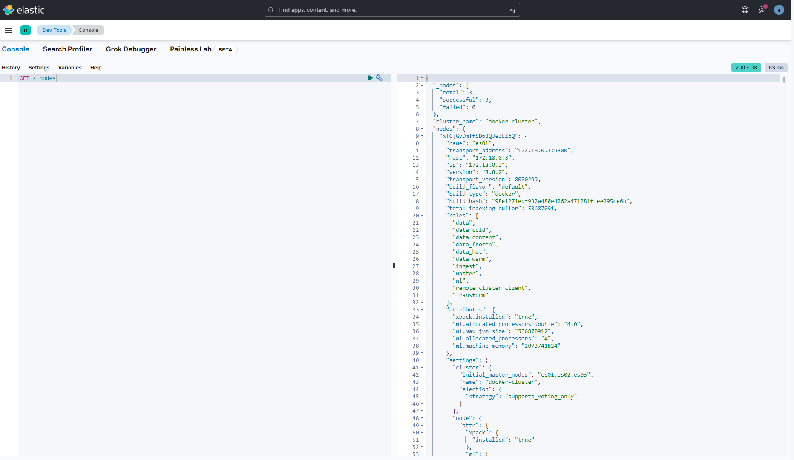

一直以來對ElasticSearch的使用都是拿來查詢Log、存放訂單資料來提供查詢等等，沒有特別深入的研究他，對於效能上的調教也都還沒實際碰到過，想說在自己Lab裡面架一台ElasticSearch來玩看看，因為Elastic Search Cloud太貴，免費又只能玩30天，雖然有辦法做到無限免費仔，但實在太花本了，就直接架在地端吧！

<!--more-->
ElasticSearch 8.8版本中，除了效能上的改進以外，我覺得對初學者最大的差別就是安全性問題的處理，舊版的ES在開發測試時幾乎可以不需要去處理這些，但新版的一開始架Cluster就會遇到這個問題，寫Log也會遇到這問題。


## Pre Steps

我使用Ubuntu22.04的VM安裝docker，可以直接使用官網上的docker-compose來架設ES，假如想安裝在WSL、Window local、Mac官網也都有教學說明。

首先在同一個Folder之下建立`.env`,`docker-compose.yml`
.env
```
# Password for the 'elastic' user (at least 6 characters)
ELASTIC_PASSWORD=Pass123

# Password for the 'kibana_system' user (at least 6 characters)
KIBANA_PASSWORD=Pass123

# Version of Elastic products
STACK_VERSION=8.8.2

# Set the cluster name
CLUSTER_NAME=docker-cluster

# Set to 'basic' or 'trial' to automatically start the 30-day trial
LICENSE=basic
#LICENSE=trial

# Port to expose Elasticsearch HTTP API to the host
ES_PORT=9200
#ES_PORT=127.0.0.1:9200

# Port to expose Kibana to the host
KIBANA_PORT=5601
#KIBANA_PORT=80

# Increase or decrease based on the available host memory (in bytes)
MEM_LIMIT=1073741824

# Project namespace (defaults to the current folder name if not set)
#COMPOSE_PROJECT_NAME=myproject
```

docker-compose.yml
```
version: "2.2"
services:
  setup:
    image: docker.elastic.co/elasticsearch/elasticsearch:${STACK_VERSION}
    volumes:
      - certs:/usr/share/elasticsearch/config/certs
    user: "0"
    command: >
      bash -c '
        if [ x${ELASTIC_PASSWORD} == x ]; then
          echo "Set the ELASTIC_PASSWORD environment variable in the .env file";
          exit 1;
        elif [ x${KIBANA_PASSWORD} == x ]; then
          echo "Set the KIBANA_PASSWORD environment variable in the .env file";
          exit 1;
        fi;
        if [ ! -f config/certs/ca.zip ]; then
          echo "Creating CA";
          bin/elasticsearch-certutil ca --silent --pem -out config/certs/ca.zip;
          unzip config/certs/ca.zip -d config/certs;
        fi;
        if [ ! -f config/certs/certs.zip ]; then
          echo "Creating certs";
          echo -ne \
          "instances:\n"\
          "  - name: es01\n"\
          "    dns:\n"\
          "      - es01\n"\
          "      - localhost\n"\
          "    ip:\n"\
          "      - 127.0.0.1\n"\
          "  - name: es02\n"\
          "    dns:\n"\
          "      - es02\n"\
          "      - localhost\n"\
          "    ip:\n"\
          "      - 127.0.0.1\n"\
          "  - name: es03\n"\
          "    dns:\n"\
          "      - es03\n"\
          "      - localhost\n"\
          "    ip:\n"\
          "      - 127.0.0.1\n"\
          > config/certs/instances.yml;
          bin/elasticsearch-certutil cert --silent --pem -out config/certs/certs.zip --in config/certs/instances.yml --ca-cert config/certs/ca/ca.crt --ca-key config/certs/ca/ca.key;
          unzip config/certs/certs.zip -d config/certs;
        fi;
        echo "Setting file permissions"
        chown -R root:root config/certs;
        find . -type d -exec chmod 750 \{\} \;;
        find . -type f -exec chmod 640 \{\} \;;
        echo "Waiting for Elasticsearch availability";
        until curl -s --cacert config/certs/ca/ca.crt https://es01:9200 | grep -q "missing authentication credentials"; do sleep 30; done;
        echo "Setting kibana_system password";
        until curl -s -X POST --cacert config/certs/ca/ca.crt -u "elastic:${ELASTIC_PASSWORD}" -H "Content-Type: application/json" https://es01:9200/_security/user/kibana_system/_password -d "{\"password\":\"${KIBANA_PASSWORD}\"}" | grep -q "^{}"; do sleep 10; done;
        echo "All done!";
      '
    healthcheck:
      test: ["CMD-SHELL", "[ -f config/certs/es01/es01.crt ]"]
      interval: 1s
      timeout: 5s
      retries: 120

  es01:
    depends_on:
      setup:
        condition: service_healthy
    image: docker.elastic.co/elasticsearch/elasticsearch:${STACK_VERSION}
    volumes:
      - certs:/usr/share/elasticsearch/config/certs
      - esdata01:/usr/share/elasticsearch/data
    ports:
      - ${ES_PORT}:9200
    environment:
      - node.name=es01
      - cluster.name=${CLUSTER_NAME}
      - cluster.initial_master_nodes=es01,es02,es03
      - discovery.seed_hosts=es02,es03
      - ELASTIC_PASSWORD=${ELASTIC_PASSWORD}
      - bootstrap.memory_lock=true
      - xpack.security.enabled=true
      - xpack.security.http.ssl.enabled=true
      - xpack.security.http.ssl.key=certs/es01/es01.key
      - xpack.security.http.ssl.certificate=certs/es01/es01.crt
      - xpack.security.http.ssl.certificate_authorities=certs/ca/ca.crt
      - xpack.security.transport.ssl.enabled=true
      - xpack.security.transport.ssl.key=certs/es01/es01.key
      - xpack.security.transport.ssl.certificate=certs/es01/es01.crt
      - xpack.security.transport.ssl.certificate_authorities=certs/ca/ca.crt
      - xpack.security.transport.ssl.verification_mode=certificate
      - xpack.license.self_generated.type=${LICENSE}
      - network.host=0.0.0.0
      - network.bind_host=0.0.0.0
    mem_limit: ${MEM_LIMIT}
    ulimits:
      memlock:
        soft: -1
        hard: -1
    healthcheck:
      test:
        [
          "CMD-SHELL",
          "curl -s --cacert config/certs/ca/ca.crt https://localhost:9200 | grep -q 'missing authentication credentials'",
        ]
      interval: 10s
      timeout: 10s
      retries: 120

  es02:
    depends_on:
      - es01
    image: docker.elastic.co/elasticsearch/elasticsearch:${STACK_VERSION}
    volumes:
      - certs:/usr/share/elasticsearch/config/certs
      - esdata02:/usr/share/elasticsearch/data
    environment:
      - node.name=es02
      - cluster.name=${CLUSTER_NAME}
      - cluster.initial_master_nodes=es01,es02,es03
      - discovery.seed_hosts=es01,es03
      - bootstrap.memory_lock=true
      - xpack.security.enabled=true
      - xpack.security.http.ssl.enabled=true
      - xpack.security.http.ssl.key=certs/es02/es02.key
      - xpack.security.http.ssl.certificate=certs/es02/es02.crt
      - xpack.security.http.ssl.certificate_authorities=certs/ca/ca.crt
      - xpack.security.transport.ssl.enabled=true
      - xpack.security.transport.ssl.key=certs/es02/es02.key
      - xpack.security.transport.ssl.certificate=certs/es02/es02.crt
      - xpack.security.transport.ssl.certificate_authorities=certs/ca/ca.crt
      - xpack.security.transport.ssl.verification_mode=certificate
      - xpack.license.self_generated.type=${LICENSE}
      - network.host=0.0.0.0
      - network.bind_host=0.0.0.0
    mem_limit: ${MEM_LIMIT}
    ulimits:
      memlock:
        soft: -1
        hard: -1
    healthcheck:
      test:
        [
          "CMD-SHELL",
          "curl -s --cacert config/certs/ca/ca.crt https://localhost:9200 | grep -q 'missing authentication credentials'",
        ]
      interval: 10s
      timeout: 10s
      retries: 120

  es03:
    depends_on:
      - es02
    image: docker.elastic.co/elasticsearch/elasticsearch:${STACK_VERSION}
    volumes:
      - certs:/usr/share/elasticsearch/config/certs
      - esdata03:/usr/share/elasticsearch/data
    environment:
      - node.name=es03
      - cluster.name=${CLUSTER_NAME}
      - cluster.initial_master_nodes=es01,es02,es03
      - discovery.seed_hosts=es01,es02
      - bootstrap.memory_lock=true
      - xpack.security.enabled=true
      - xpack.security.http.ssl.enabled=true
      - xpack.security.http.ssl.key=certs/es03/es03.key
      - xpack.security.http.ssl.certificate=certs/es03/es03.crt
      - xpack.security.http.ssl.certificate_authorities=certs/ca/ca.crt
      - xpack.security.transport.ssl.enabled=true
      - xpack.security.transport.ssl.key=certs/es03/es03.key
      - xpack.security.transport.ssl.certificate=certs/es03/es03.crt
      - xpack.security.transport.ssl.certificate_authorities=certs/ca/ca.crt
      - xpack.security.transport.ssl.verification_mode=certificate
      - xpack.license.self_generated.type=${LICENSE}
      - network.host=0.0.0.0
      - network.bind_host=0.0.0.0
    mem_limit: ${MEM_LIMIT}
    ulimits:
      memlock:
        soft: -1
        hard: -1
    healthcheck:
      test:
        [
          "CMD-SHELL",
          "curl -s --cacert config/certs/ca/ca.crt https://localhost:9200 | grep -q 'missing authentication credentials'",
        ]
      interval: 10s
      timeout: 10s
      retries: 120

  kibana:
    depends_on:
      es01:
        condition: service_healthy
      es02:
        condition: service_healthy
      es03:
        condition: service_healthy
    image: docker.elastic.co/kibana/kibana:${STACK_VERSION}
    volumes:
      - certs:/usr/share/kibana/config/certs
      - kibanadata:/usr/share/kibana/data
    ports:
      - ${KIBANA_PORT}:5601
    environment:
      - SERVERNAME=kibana
      - ELASTICSEARCH_HOSTS=https://es01:9200
      - ELASTICSEARCH_USERNAME=kibana_system
      - ELASTICSEARCH_PASSWORD=${KIBANA_PASSWORD}
      - ELASTICSEARCH_SSL_CERTIFICATEAUTHORITIES=config/certs/ca/ca.crt
    mem_limit: ${MEM_LIMIT}
    healthcheck:
      test:
        [
          "CMD-SHELL",
          "curl -s -I http://localhost:5601 | grep -q 'HTTP/1.1 302 Found'",
        ]
      interval: 10s
      timeout: 10s
      retries: 120

volumes:
  certs:
    driver: local
  esdata01:
    driver: local
  esdata02:
    driver: local
  esdata03:
    driver: local
  kibanadata:
    driver: local
```

有一個重點是因為ES有可能會需要創建大量的memory map，所以必須設定`max_map_count`的數量，以讓他正常運行。\
註:這個設定的語法在不同OS裡面是不一樣的
```
sysctl -w vm.max_map_count=262144
```

## Verify

寫入ES的方式很多，透過LogStash、FileBeat、Fluentd或是直接透過Application等等，這部分留著之後談，直接先使用內部的Dev tools取得Node，的確有三個


Reference:
* https://www.elastic.co/guide/en/elasticsearch/reference/current/release-highlights.html
* https://www.elastic.co/guide/en/elasticsearch/reference/current/docker.html#_set_vm_max_map_count_to_at_least_262144