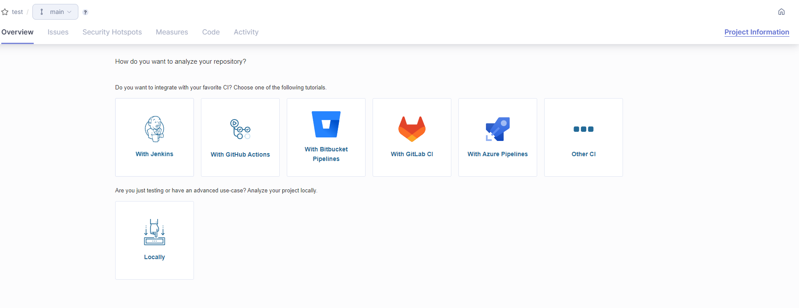
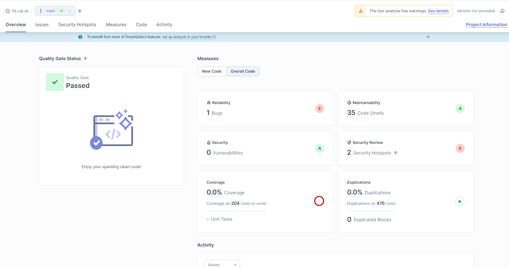
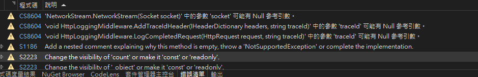

SonarQube 是一套開源的程式碼品質的管理分析系統，可以拿來檢查程式碼的錯誤、漏洞或是Code smell，支援了超級多的語言和IDE，還可以搭配CI/CD工具去做一些自動化掃描，例如在Jenkins / Github Action / Azure DevOps等等，有些高級的服務雖然要錢，例如說程式碼品質要過才能Merge回去、產生報告等等，但基本的分析其實就已經很實用了。

在每次的CI/CD掃描是很方便的事，但一個團隊一天PR不知道有多少，這樣掃描修改掃描的過程還是蠻花時間的，所以有了SonarLint這工具，可以直接在客戶端使用並掃描當前的程式碼，大大減少了在CICD掃描的過程。

<!--more-->

## 安裝SonarQube

老樣子docker-compose
```
version: "3.8"
services:
  sonarqube:
    image: sonarqube:community
    restart: always
    hostname: sonarqube
    container_name: sonarqube
    depends_on:
      - db
    environment:
      SONAR_JDBC_URL: jdbc:postgresql://db:5432/sonar
      SONAR_JDBC_USERNAME: sonar
      SONAR_JDBC_PASSWORD: sonar
    volumes:
      - sonarqube_data:/opt/sonarqube/data
      - sonarqube_extensions:/opt/sonarqube/extensions
      - sonarqube_logs:/opt/sonarqube/logs
    ports:
      - "9001:9000"

  db:
    image: postgres:13
    restart: always
    hostname: postgresql
    container_name: postgresql
    environment:
      POSTGRES_USER: sonar
      POSTGRES_PASSWORD: sonar
      POSTGRES_DB: sonar
    volumes:
      - postgresql:/var/lib/postgresql
      - postgresql_data:/var/lib/postgresql/data

volumes:
  sonarqube_data:
  sonarqube_extensions:
  sonarqube_logs:
  postgresql:
  postgresql_data:
```
起來之後訪問網站，預設帳號密碼是admin/admin \

選擇Create a Project，內容都可以亂輸入沒關係，接著在這畫面可以選擇要透過CI工具來整合，或是直接在Locally，點進去都會看到很簡單的教學，這次先使用Locally。


接著可以一步一步按照他的教學走，但是要切記他有使用`dotnet-sonarscanner`這工具，假設出現Error內容是
```
19:57:50.563  The token you provided doesn't have sufficient rights to check license.
19:57:50.565  Pre-processing failed. Exit code: 1
```
直接更新dotnet-sonarscanner就對了，可以少走很多冤枉路XD
原本還一直以為是權限問題弄了好久 \

照著步驟走後掃描完畫面就會像下面一樣美美的，接著就可以看看他給你的程式碼建議囉 😆


## SonarLint Extension 

SonarLint有兩種模式
* 獨立模式
* 連線模式

可以直接到Vistual studio的擴充套件下載
SonarLint for Visual Studio 2022
或直接用連結下載:
[SonarLint Extension](https://marketplace.visualstudio.com/items?itemName=SonarSource.SonarLintforVisualStudio2022)


### 獨立模式

獨立模式是最簡單的，只有安裝好後從IDE上的分析 => 執行 Code Analysis，接著就可以看到滿滿的Warning，除了大部分C開頭是微軟的Warning的，也會有少部分的S開頭是SonrLint的


詳細設定可以看這個網站
https://rules.sonarsource.com/

### 連線模式

假設是一個團隊會定義很多Codeing style等等，就會需要使用連線模式來統一標準，連線模式會需要一台Sonqube Server，你可以使用SonarCloud，也可以選擇自己直接在地端架設，在延伸模組裡面選擇SonarLint => ConnectMode => Bind SonarQube or SonarCloud，接著輸入URL選擇對應的Project就完成了。


## Pre Steps


Reference:
* https://docs.sonarqube.org/latest/
