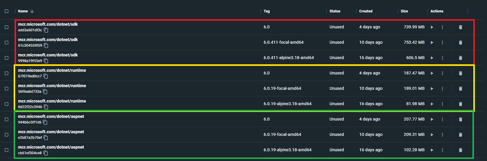

容器化已經慢慢變一個趨勢了(當然還有更潮的ServerLess)，聽到的大部分公司不是正在前往容器化的路上就是已經完成容器化，甚至Dotnet在建立專案的時候都可以直接建立Dockfile，執行的時候也可以直接用docker container的方式執行，簡直有夠完美，但假設接下來會需要整合自己的CI/CD流程，這個時候就很需要自定義dockerfile了。

<!--more-->

## .NET SDK

在使用 .NET CLI的指令時，我們會需要用到的是 .NET SDK，裡面也包含了 .NET runtime等等，在官網下載時，也是直接下載SDK，但當我們發佈檔案要部屬時，這些指令對我們來說是完全用不到的，所以在一般情況下並不會把 .NET SDK包裝在要執行的Container裡面。

## .NET Runtime

顧名思義，就是在執行期間會需要的，所以這是必要的，


## Dotnet預設的Dockerfile

當建立一個新專案時，假如選擇Web Api，dotent會詢問你是否要使用docker image，如果選擇是之後系統就會很貼心的幫你建立以下的Dockerfile
```
#See https://aka.ms/customizecontainer to learn how to customize your debug container and how Visual Studio uses this Dockerfile to build your images for faster debugging.

FROM mcr.microsoft.com/dotnet/aspnet:6.0 AS base
WORKDIR /app
EXPOSE 80
EXPOSE 443

FROM mcr.microsoft.com/dotnet/sdk:6.0 AS build
WORKDIR /src
COPY ["WebApplication7/WebApplication7.csproj", "WebApplication7/"]
RUN dotnet restore "WebApplication7/WebApplication7.csproj"
COPY . .
WORKDIR "/src/WebApplication7"
RUN dotnet build "WebApplication7.csproj" -c Release -o /app/build

FROM build AS publish
RUN dotnet publish "WebApplication7.csproj" -c Release -o /app/publish /p:UseAppHost=false

FROM base AS final
WORKDIR /app
COPY --from=publish /app/publish .
ENTRYPOINT ["dotnet", "WebApplication7.dll"]
```
可以看到這個Dockerfile分四大部分
1. base
2. build
3. publish
4. final

base => build => publish 在還沒有容器化的時候就已經存在了，最後的Final只是透過`dotnet {dll name}`執行起來而已。

一開始看到`mcr.microsoft.com/dotnet/aspnet:6.0`想說這是什麼？ \
為什麼不是 .NET Runtime？ \
實際上使用在[Docker repo](https://hub.docker.com/_/microsoft-dotnet-aspnet)會看到這個實際上是dotnet runtime的Image，主要是針對Web MVC之類的包裝起來，相對之下比較通用一點點，但以Web Api來說單純的runtime其實就已經足夠了。

這部分可以從[dotnet-dokcer](https://github.com/dotnet/dotnet-docker/tree/main/src)來尋找一些端倪。

順便整理了微軟、Ubuntu和Alpine的`aspnet runtime`、`runtime`、`sdk`Image的大小，可以發現dotnet官方原生通常都比較大一點，Alpine只占用了約一半的容量。

`Ubuntu`、`Deibian`、`Alpine`要選擇哪個？ 
在Base Image的選擇上也是一個值得討論的問題，Ubuntu是基於Deibian，這兩個可以先放在一起討論，Alpine主打的是輕量化，在設計原則上只提供必要，但在社群上相比Deibian之下比較小，
，而Deibian主打的是全面和穩定，社群也比較活躍，而目前在微軟預設是選擇Deibian，畢竟是官方，全面和穩定總是比較重要的XD



## 自定義Dotnet Image

接著如果要整合CI/CD流程，以CI來說基本的`dotnet build`、`dotnet restore`、`dotnet test`是必要的，所以也不想多想，就是安裝dotnet sdk，把Image拆開可以做很多事，例如你有些習慣的資源或Script會需要先執行等等，都可以經過一層包裝。

```
ARG REPO_NAME=mcr.microsoft.com/dotnet/sdk
ARG PROJECT_NAME=proj

FROM ${REPO_NAME}:latest AS build

WORKDIR /app

COPY . .
RUN dotnet restore ${PROJECT_NAME}
RUN dotnet build ${PROJECT_NAME}
RUN dotnet test ${PROJECT_NAME}

# docker build --build-arg PROJECT_NAME={your_custom_project_name} -t {tag_name} .
```
.NET CLI指令雖然會自動抓取project name，但是假設專案很多，或是一個sln裡面包裝很多project，就會需要其他指令來協助，這個Dockerfile寫的還有很多地方可以調整，但一般情況下也算夠用了。

假設今天是要build runtime image的，則可以只拉runtime下來。
```
FROM mcr.microsoft.com/dotnet/runtime:latest AS runtime
WORKDIR /app
ARG PROJECT_NAME
ENV dll="/app/${PROJECT_NAME}.dll"

COPY --from=build /app/out ./

ENV PORT=12345
EXPOSE $PORT

# Define the urls environment variable
ENV URLS=http://*:$PORT

ENTRYPOINT dotnet ${dll} --urls ${URLS}

# docker build --build-arg PROJECT_NAME={your_custom_project_name} -t {tag_name} .
```
Reference:
* https://andrewlock.net/exploring-the-net-core-mcr-docker-files-runtime-vs-aspnet-vs-sdk/
* https://www.turnkeylinux.org/blog/alpine-vs-debian#:~:text=Debian%20is%20superior%20compared%20to%20Alpine%20Linux%20with,present%20and%20future%20security%20of%20its%20build%20infrastructure
* https://github.com/dotnet/dotnet-docker/tree/main/src

