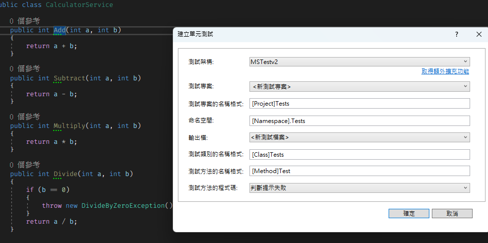
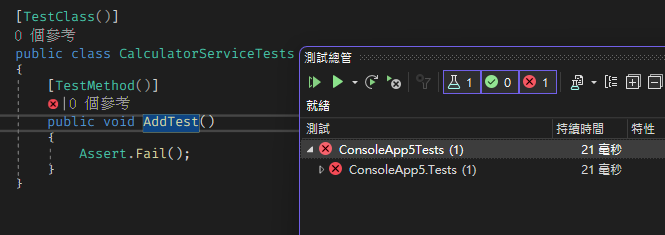
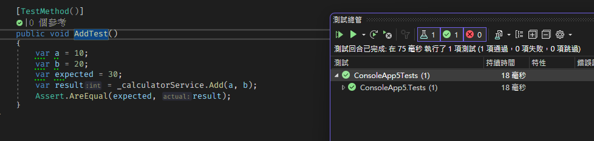
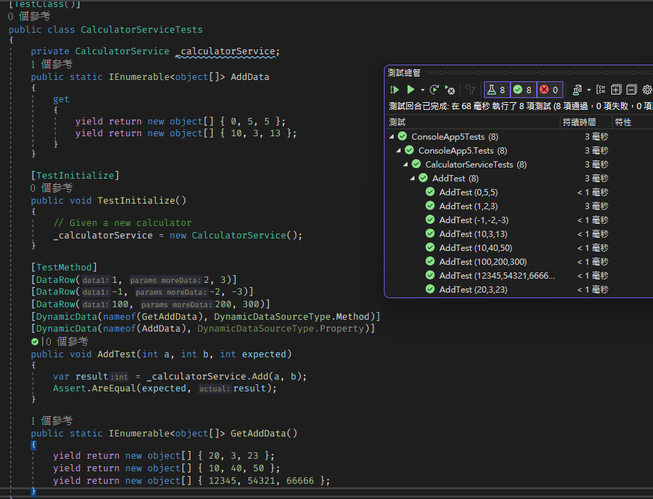
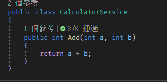

平常工作上的測試框架都是使用xunit，但 .NET自己其實就有測試框架，而且在Vistual Studio的整合度也是最高的，所以我自己私心喜歡MS Test，而Test Deiver的框架，我覺得依照個人喜好，例如BDD的的優點是讓測試敘述易讀，可以讓後續維護方便和非開發人員也能看懂測試案例，但以自己隨便寫的小專案來說，我覺得不需要用到這麼大的陣仗，測試只要包含核心邏輯即可，所以趁著有一點時間來練習一下怎麼使用MS Test。

<!--more-->

## Code Sample

要測試當然要有測試的程式，也會有利用測試的方式撰寫程式，例如TDD、BDD等等，但這不在這篇的範圍內，就先寫個只包含加減乘除的計算機程式。

```
    public class CalculatorService
    {
        public int Add(int a, int b)
        {
            return a + b;
        }

        public int Subtract(int a, int b)
        {
            return a - b;
        }

        public int Multiply(int a, int b)
        {
            return a * b;
        }

        public int Divide(int a, int b)
        {
            if (b == 0)
            {
                throw new DivideByZeroException();
            }
            return a / b;
        }
    }
```
接著在Vistual Studio內，只需要對Function右鍵，建立單元測試，就可以直接選擇建立測試專案了，當然也可以直接新增測試專案，這部分就各憑喜好。


## 單元測試

建立測後會看到Class上面會特別標註了[TestClass]，而測試的Function上則有[TestMethod]，這些都是在MS Test上專用的Attribute，實際上還有很多的Attribute，這部分可以參考[MS Test文件](https://github.com/Microsoft/testfx-docs)，因為在實務上不可能每個測試案例都這麼單純，一定會需要大量的資料或是不同類型的資料結構，這時候這些Attribute就可以派上用場了。

簡單整理了幾個Attribute代表的意義
* 執行階段
  * TestClass 測試類別
  * TestMethod 測試方法
  * ClassInitialize 執行第一個測試前會被調用
  * TestInitialize 執行每個測試前就會被調用，會在Ctor 結束後以及TestMethod前
  * ClassCleanup 所有的測試結束後執行
  * TestCleanip 每個測試結束後就會執行
* 測試資料
  * DataRow 直接給測試方法的參數資料
  * DynamicData 從Function、Property取得資料
  * DataSource 可以從外部讀取XML,CSV等測試資料
  * ExpectedException 預期測試結果是Exception

```
    [TestClass()]
    public class CalculatorServiceTests
    {
        [TestMethod()]
        public void AddTest()
        {
            Assert.Fail();
        }
    }
```
接著可以直接執行測試，可以輸入`dotnet test`或是直接對專案、Function本身右鍵執行就可以

第一次執行的Function一定是紅燈XD，接著需要為了測試補齊程式。

```
    [TestClass()]
    public class CalculatorServiceTests
    {
        private CalculatorService _calculatorService;
        
        [TestInitialize]
        public void TestInitialize()
        {
            // Given a new calculator
            _calculatorService = new CalculatorService();
        }

        [TestMethod()]
        public void AddTest()
        {
            var a = 10;
            var b = 20;
            var expected = 30;
            var result = _calculatorService.Add(a, b);
            Assert.AreEqual(expected, result);
        }
    }
```


毫不意外的成功了，接著抽出假資料的部分，讓資料來源從外部給予
```
    [TestClass()]
    public class CalculatorServiceTests
    {
        private CalculatorService _calculatorService;
        public static IEnumerable<object[]> AddData
        {
            get
            {
                yield return new object[] { 0, 5, 5 };
                yield return new object[] { 10, 3, 13 };
            }
        }

        [TestInitialize]
        public void TestInitialize()
        {
            // Given a new calculator
            _calculatorService = new CalculatorService();
        }

        [TestMethod]
        [DataRow(1, 2, 3)]
        [DataRow(-1, -2, -3)]
        [DataRow(100, 200, 300)]
        [DynamicData(nameof(GetAddData), DynamicDataSourceType.Method)]
        [DynamicData(nameof(AddData), DynamicDataSourceType.Property)]
        public void AddTest(int a, int b, int expected)
        {
            var result = _calculatorService.Add(a, b);
            Assert.AreEqual(expected, result);
        }

        public static IEnumerable<object[]> GetAddData()
        {
            yield return new object[] { 20, 3, 23 };
            yield return new object[] { 10, 40, 50 };
            yield return new object[] { 12345, 54321, 66666 };
        }
    }
```


我喜歡MS Test的地方是Function本身有被標示他被保護的綠勾勾 😆


到這邊就算告一段落啦，差從外部獲取Csv檔的部分沒有練習到，但有這種狀況的情況應該很少，而且很有可能是需要與QA、PM配合的，以後寫自己寫LAB的時候可以更得心應手了。
測試的方法、測試方式和測試的設計其實都很重要，因為只要測試設計得不好，很有可能在之後改需求的時候異動到，導致時間都花在改測試上面，這部分就很需要拿捏，重構造時不只需要重構程式碼本身，測試本身也是需要重構的。

Reference:
* https://github.com/Microsoft/testfx-docs
* https://www.automatetheplanet.com/mstest-cheat-sheet/
