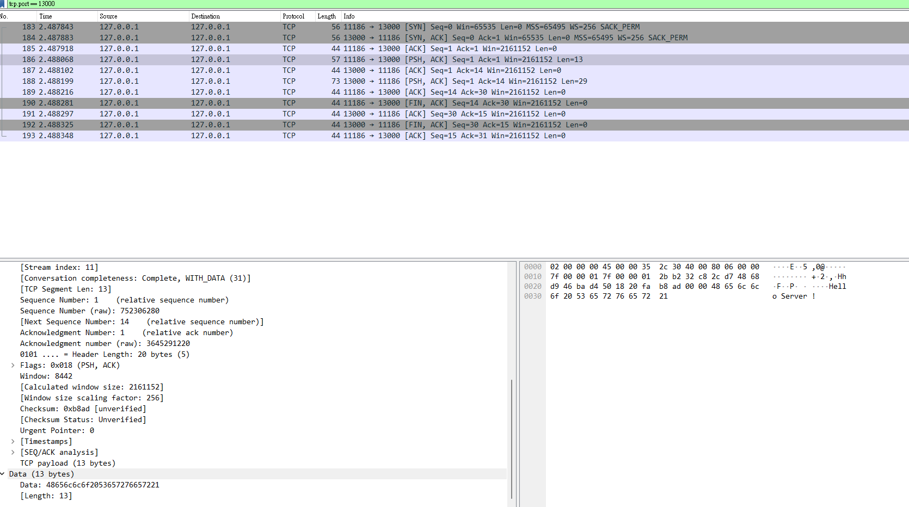

常常聽到TCP、UDP等等ProtocolType，但這些東西都被封裝得好好的，實在是沒自己特別寫過，基於好玩想說來測試看看，.NET 自己有實作了`TcpClient`和`TcpListener`，實現方式也很簡單，不過官網明確說明了建議進階使用者使用`Socket Class`，因為`TcpClient`和`TcpListener`建立在`System.Net.Sockets.Socket `之上，不過今天是想抓抓看傳輸內容，所以就直接用`TcpClient`和`TcpListener`吧，`Socket Class`就等下篇文章了。
<!--more-->

## Example Code

使用`TcpClient`和`TcpListener`很簡單，只要一端負責監聽這個Port，另一端負責傳輸訊息就好了，要注意的是使用Byte Stream來傳輸。
```
//Client end
void Main()
{
	var port = 13000;
	var client = new TcpClient("127.0.0.1", port);

	var message = "Hello, Server!";
	var data = Encoding.ASCII.GetBytes(message);
	var stream = client.GetStream();
	stream.Write(data, 0, data.Length);

	Console.WriteLine("Sent: {0}", message);

	data = new byte[256];
	var responseData = String.Empty;
	var bytes = stream.Read(data, 0, data.Length);
	responseData = Encoding.ASCII.GetString(data, 0, bytes);
	Console.WriteLine("Received: {0}", responseData);

	stream.Close();
	client.Close();
}

//Server end
void Main()
{	
	int port = 13000;
	var localAddr = IPAddress.Parse("127.0.0.1");
	var server = new TcpListener(localAddr, port);
	server.Start();

	Console.WriteLine("Waiting for a connection...");
	
	while (true)
	{
		var client = server.AcceptTcpClient();
		Console.WriteLine("Connected!");

		var stream = client.GetStream();
		var buffer = new byte[256];
		int i;
		while ((i = stream.Read(buffer, 0, buffer.Length)) != 0)
		{
			var data = Encoding.ASCII.GetString(buffer, 0, i);
			Console.WriteLine("Received: {0}", data);

			data = "Server received your message!";
			buffer = Encoding.ASCII.GetBytes(data);
			stream.Write(buffer, 0, buffer.Length);
			Console.WriteLine("Sent: {0}", data);
		}

		client.Close();
	}
}

```
## Wireshark介紹

平常看這樣傳輸其實很沒有實感XD
所以找到了一個工具`wireshark`，他是一個用C語言寫的開源網路封包抓取工具

GitLab Link: https://gitlab.com/wireshark/wireshark

使用方式也蠻直覺的，一開始選擇要抓取的網路卡，接著就有很直覺的搜尋畫面可以搜尋和監看。
這邊先介紹TCP協議中幾個常見的Flag的意思

* SYN（Synchronize）：在TCP連接的建立過程，用來初始化。
* FIN（Finish）：在TCP連接關閉時，用來結束連接。
* ACK（Acknowledgment）：用於確認已經收到數據的。
* PSH（Push）： 表示數據傳輸，不等待Buffer填滿。
* RST（Reset）：強制中斷連接或指示連接有出現錯誤。
* URG（Urgent）：裡面包含緊急數據，必須優先處理這些數據。

因為我監聽的port號是13000，所以我搜尋條件就先設定`tcp.port == 13000`，接著使用Client端發送訊息得到了下面的結果。

```
"No.","Time","Source","Destination","Protocol","Length","Info"
"183","2.487843","127.0.0.1","127.0.0.1","TCP","56","11186  >  13000 [SYN] Seq=0 Win=65535 Len=0 MSS=65495 WS=256 SACK_PERM"
"184","2.487883","127.0.0.1","127.0.0.1","TCP","56","13000  >  11186 [SYN, ACK] Seq=0 Ack=1 Win=65535 Len=0 MSS=65495 WS=256 SACK_PERM"
"185","2.487918","127.0.0.1","127.0.0.1","TCP","44","11186  >  13000 [ACK] Seq=1 Ack=1 Win=2161152 Len=0"
"186","2.488068","127.0.0.1","127.0.0.1","TCP","57","11186  >  13000 [PSH, ACK] Seq=1 Ack=1 Win=2161152 Len=13"
"187","2.488102","127.0.0.1","127.0.0.1","TCP","44","13000  >  11186 [ACK] Seq=1 Ack=14 Win=2161152 Len=0"
"188","2.488199","127.0.0.1","127.0.0.1","TCP","73","13000  >  11186 [PSH, ACK] Seq=1 Ack=14 Win=2161152 Len=29"
"189","2.488216","127.0.0.1","127.0.0.1","TCP","44","11186  >  13000 [ACK] Seq=14 Ack=30 Win=2161152 Len=0"
"190","2.488281","127.0.0.1","127.0.0.1","TCP","44","11186  >  13000 [FIN, ACK] Seq=14 Ack=30 Win=2161152 Len=0"
"191","2.488297","127.0.0.1","127.0.0.1","TCP","44","13000  >  11186 [ACK] Seq=30 Ack=15 Win=2161152 Len=0"
"192","2.488325","127.0.0.1","127.0.0.1","TCP","44","13000  >  11186 [FIN, ACK] Seq=30 Ack=15 Win=2161152 Len=0"
"193","2.488348","127.0.0.1","127.0.0.1","TCP","44","11186  >  13000 [ACK] Seq=15 Ack=31 Win=2161152 Len=0"
```

從這段內容中可以得到了TCP連接的三次握手過程
* SYN (同步)
* SYN-ACK(同步確認)
* ACK(確認)

### 讀取資料

接下來可以從PSH裡面看到推送的訊息

Data: 48656c6c6f2053657276657221
Data:53657276657220726563656976656420796f7572206d65737361676521
接著讓這16進位的內容轉換，寫了一段C#
```
void Main()
{
	var hexString1 = "48656c6c6f2053657276657221";
	var hexString2 = "53657276657220726563656976656420796f7572206d65737361676521";	
	ParseHexString(hexString1);
	ParseHexString(hexString2);
}
public void ParseHexString(string str)
{
	byte[] bytes = Enumerable.Range(0, str.Length / 2)
							 .Select(x => Convert.ToByte(str.Substring(x * 2, 2), 16))
							 .ToArray();
	string ascii = Encoding.ASCII.GetString(bytes);
	Console.WriteLine(ascii);
}
Output:
Hello Server!
Server received your message!
```
在寫這一段的時候一直覺得哪裡不太對勁，想了想可能是因為沒有必要特別用C#寫，所以順便學了一下bash和Power Shell的語法，尤其是bash真的快很多，內建就有處理了這些轉換，只需要`echo -n $hex | xxd -r -p`就夠了XD

```
#!/bin/bash
# hex_to_ascii.sh

if [ -z "$1" ]
then
    echo "No argument supplied. Please provide hex string."
    exit 1
fi

hex=$1
echo -n $hex | xxd -r -p
echo

#Output:
#sh hex_to_ascii.sh 53657276657220726563656976656420796f7572206d65737361676521
#Server received your message!
```
```
# hex-to-ascii.ps1
param (
    [Parameter(Mandatory=$false)]
    [string]$hex
)

if (-not $hex) {
    Write-Host "No argument supplied. Please provide hex string."
    exit 1
}

$bytes = [System.Convert]::FromHexString($hex)
$ascii = [System.Text.Encoding]::ASCII.GetString($bytes)
Write-Host $ascii

#Output:
#.\hex-to-ascii.ps1 -hex #"53657276657220726563656976656420796f7572206d65737361676521"
#Server received your message!
```
這樣實測下來對TCP的三次握手有更深入的了解，也對資料的安全性更重視

Reference:
https://www.wireshark.org/
https://learn.microsoft.com/zh-tw/dotnet/fundamentals/networking/sockets/tcp-classes?WT.mc_id=DT-MVP-4015686
https://www.bing.com/search?pglt=43&q=linux+xxd&cvid=57af4bc1ba2a425e90aea869c0084961&aqs=edge..69i57j0l8.2125j0j1&FORM=ANNTA1&PC=U709